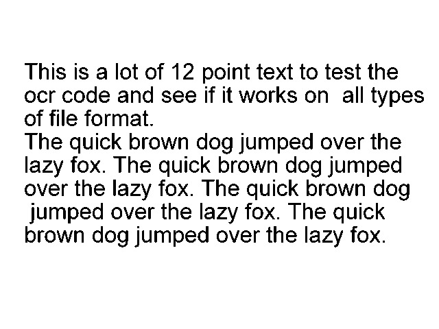
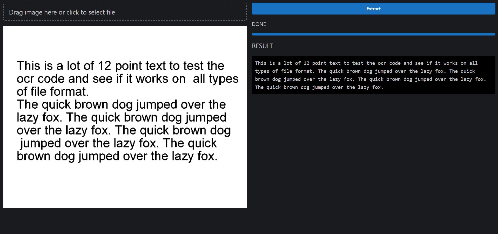

# Tesseract.JS

Tesseract.js is an open-source JavaScript library that provides OCR (Optical Character Recognition) functionalities in the browser. It is a port of the Tesseract OCR engine, which is a popular open-source OCR engine that has been developed by Google since 2006.

## Features

<ul>
    <li> Real-time OCR for images or scanned documents within web applications
 </li>
    <li> Supports over 100 languages
 </li>
    <li> Provides a powerful API for customizing and improving OCR accuracy
 </li>
    <li> Supports training your own models
 </li>
</ul>

# DEPLOYED VERSION 

<a href = "https://lakshya-gg.github.io/TesseractJS" target = "_blank">Click here to checkout the deployed version of TesseractJS</a>

## Getting Started

To get started with Moneymate, follow the steps below:

1. Install Node.js on your machine.
2. Clone the repository: `https://github.com/Lakshya-GG/TesseractJS.git`
3. Install dependencies: `npm install`
4. Start the development server: `npm run dev`
5. Open the app in your browser: <a href = "http://localhost:3000 ">`http://localhost:3000`</a>

## Usage

To recognize text from an image or scanned document, you can use the recognize method:

```javascript
Tesseract.recognize('https://tesseract.projectnaptha.com/img/eng_bw.png')
  .then(function(result) {
    console.log(result.text);
  });
```
This will output the recognized text from the image.

## Ouput Sample 

The Input image : 



Generated Output : 



## Code Demo 


This is a React component that utilizes the Tesseract.js library to perform OCR (Optical Character Recognition) on an image dropped or selected by the user.

The component starts by defining state variables using the '**useState hook**', including '**imageData**' which stores the image data URL of the selected image,
```typescript
const Home = () => {
  const [imageData, setImageData] = useState<null | string>(null);
  const loadFile = (file: File) => {
    const reader = new FileReader();
    reader.onloadend = () => {
      const imageDataUri = reader.result;
      setImageData(imageDataUri as string);
    };
    reader.readAsDataURL(file);
  }};
```
 '**progress**' and '**progressLabel**' which are used to track the progress of OCR,
 ```typescript
   const [progress, setProgress] = useState(0);
   const [progressLabel, setProgressLabel] = useState('idle');
 ```
 and '**ocrResult**' which stores the recognized text.
```typescript
const [ocrResult, setOcrResult] = useState('');
```

The '**loadFile**' function uses the '**FileReader**' API to convert the selected image file into a data URL and update the '**imageData**' state.

The component then creates a '**workerRef**' using the '**useRef**' hook, which will hold a reference to the Tesseract worker that performs OCR. 

```typescript
const workerRef = useRef<Tesseract.Worker | null>(null);
```
The '**useEffect**' hook is used to initialize the '**workerRef**' with a new Tesseract worker and terminate it when the component unmounts.
```typescript
useEffect(() => {
workerRef.current = createWorker({
    logger: message => {
    if ('progress' in message) {
        setProgress(message.progress);
        setProgressLabel(message.progress == 1 ? 'Done' : message.status);
    }
    }
});
return () => {
      workerRef.current?.terminate();
      workerRef.current = null;
    }
  }, []);
```

The '**handleExtract**' function is called when the user clicks the "Extract" button. It first sets the progress and progress label to indicate that OCR is starting. 
```typescript
  const handleExtract = async () => {
    setProgress(0);
    setProgressLabel('starting');
```
Then, it loads the Tesseract worker, language data, and initializes it. 
```typescript
const worker = workerRef.current!;
    await worker.load();
    await worker.loadLanguage('eng');
    await worker.initialize('eng');
```
Finally, it performs OCR on the selected image using the '**recognize**' method of the Tesseract worker and updates the '**ocrResult**' state with the recognized text.
```typescript
const response = await worker.recognize(imageData!);
    setOcrResult(response.data.text);
    console.log(response.data);
```    

The component renders a '**Dropzone**' from the '**@mantine/dropzone**' library that allows the user to select or drag and drop an image file. If an image has been selected, it displays the image using the Image component from the '**@mantine/core**' library.
```typescript
<Dropzone
          onDrop={(files) => loadFile(files[0])}
          accept={IMAGE_MIME_TYPE}
          multiple={false}
        >{() => (
          <Text size="xl" inline>
            Drag image here or click to select file
          </Text>
        )}
</Dropzone>
```

The component also renders a button that calls the '**handleExtract**' function when clicked, and displays the progress of OCR using the '**Progress**' component and the progress label using the '**Text**' component.
```typescript
<Text>{progressLabel.toUpperCase()}</Text>
        <Progress value={progress * 100} />
```

If OCR has been performed and text has been recognized, the component displays the recognized text using the '**Text**' component with a monospace font and a black background.
```typescript
<Text size='xl'>RESULT</Text>
          <Text style={{ fontFamily: 'monospace', background: 'black', padding: '10px' }}>{ocrResult}
</Text>
```

## Training

If you need to recognize text in a specific language or font, you can train your own model using Tesseract.js. The training process involves creating training data and training the model using the tesstrain command-line tool.

For more information on training your own model, please refer to the <a href = "https://tesseract-ocr.github.io/tessdoc/Training-Tesseract-4.00.html" target = "_blank">official Tesseract documentation.</a>

## Conclusion

Overall, Tesseract.js is a powerful and easy-to-use OCR library for web developers who need to recognize text from images or scanned documents in their web applications. With its support for multiple languages and powerful API, it's a great choice for any OCR-related task.


## Contributing

Contributions to this project are welcome. To contribute, follow these steps:

1. Fork the repository: `https://github.com/Lakshya-GG/TesseractJS.git`
2. Create a new branch: `git checkout -b feature/your-feature`
3. Make changes and commit them: `git commit -am 'Add some feature'`
4. Push to the branch: `git push origin feature/your-feature`
5. Submit a pull request
   
## 🧾 License

This game is licensed under the [MIT License](https://opensource.org/license/mit/). Please see the [LICENSE](https://github.com/Lakshya-GG/TesseractJS/blob/main/LICENSE) file for more information.


